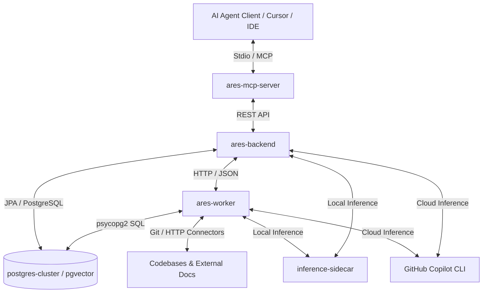

# Project ARES: Architectural Retrieval and Evaluation System

Project ARES (**Architectural Retrieval and Evaluation System**) is an enterprise-grade autonomous AI Agent platform designed to automate architectural governance, planning, and compliance verification across distributed software systems. 

ARES connects codebases and specification documents with LLM reasoning agents to ensure that every development step aligns with corporate engineering standards, compliance requirements, and architectural blueprints.

---

## 🚀 Key Capabilities (Autonomous AI Agent Features)

*   **Context-Aware Architectural Planning**: Dynamically retrieves local codebase structures and external documentation (Notion, Rally, etc.) using `pgvector` similarity search to automatically draft detailed, architecturally-compliant implementation blueprints.
*   **Automated Verification & Compliance Guardrails**: Reviews proposed code changes (via git diffs) against reference context and policy manuals. It acts as an automated gateway that approves changes or highlights compliance violations before code is merged.
*   **Hybrid Inference Routing (Cloud & Edge)**: Flexibly adapts its inference layer. It routes queries to the GitHub Copilot CLI for cloud-managed LLMs, or falls back to a fully local, offline sidecar running Ollama (`nomic-embed-text` for embeddings, `llama3` for text generation).
*   **Multi-Connector Ingestion (ETL) Engine**: Automates the parsing, chunking, and semantic embedding of codebases (via shallow Git clones) and project management platforms (Notion pages, Rally tasks, and standard HTTP endpoints).
*   **Agentic Model Context Protocol (MCP)**: Implements process-level stdio MCP server bindings, allowing developers to plug ARES tools directly into modern agentic workflows (e.g. Cursor, Windsurf, Claude Desktop).

---

## 🏗️ System Architecture



ARES is structured as a collection of modular containerized services:
1.  **`ares-backend`**: A Spring Boot 4.0.6 (Java 21) REST orchestration service using Virtual Threads for asynchronous task scheduling. It manages projects, users, job statuses, and planning orchestration.
2.  **`ares-worker`**: A FastAPI (Python 3.12) worker that performs CPU/network-heavy ETL operations, including shallow Git cloning, text chunking, external document parsing, and inference wrappers.
3.  **`ares-mcp-server`**: A TypeScript (Bun) command-line application implementing the Model Context Protocol (MCP) using a stdio transport layer.
4.  **`postgres-cluster`**: A database service running `pgvector/pgvector:pg16` for persisting relational entities and executing vector similarity searches.
5.  **`inference-sidecar`**: An Ollama (v0.3.14) container hosting the `nomic-embed-text` embedding weights and `llama3` model for offline operation.

---

## 📂 Codebase Structure & File Mapping

*   **[`ares-backend/`](ares-backend)**: Java 21 / Spring Boot 4.0.6 Backend Orchestrator.
    *   **[`AresBackendApplication.java`](ares-backend/src/main/java/codes/ani/ares/backend/AresBackendApplication.java)**: Entrypoint.
    *   **[`config/`](ares-backend/src/main/java/codes/ani/ares/backend/config)**:
        *   [`WebMvcSecurityConfig.java`](ares-backend/src/main/java/codes/ani/ares/backend/config/WebMvcSecurityConfig.java): Interceptor registry.
        *   [`DeveloperTokenInterceptor.java`](ares-backend/src/main/java/codes/ani/ares/backend/config/DeveloperTokenInterceptor.java): Validates `X-ARES-GH-PAT` against GitHub API, performs RBAC check, and caches User object.
        *   [`WorkerClientConfig.java`](ares-backend/src/main/java/codes/ani/ares/backend/config/WorkerClientConfig.java): RestClient config with timeouts.
        *   [`AsyncConfig.java`](ares-backend/src/main/java/codes/ani/ares/backend/config/AsyncConfig.java): Multi-threaded execution pool.
    *   **[`controller/`](ares-backend/src/main/java/codes/ani/ares/backend/controller)**:
        *   [`BaselineController.java`](ares-backend/src/main/java/codes/ani/ares/backend/controller/BaselineController.java): REST endpoints for onboarding users, registering codebases, and ingesting documents.
        *   [`JobController.java`](ares-backend/src/main/java/codes/ani/ares/backend/controller/JobController.java): REST endpoints for creating jobs, retrieving status, and triggering planning or verification flows.
    *   **[`service/`](ares-backend/src/main/java/codes/ani/ares/backend/service)**:
        *   [`JobPlanningService.java`](ares-backend/src/main/java/codes/ani/ares/backend/service/JobPlanningService.java): Coordinates asynchronous parallel retrieval (codebase & docs) and telemetry pacing.
        *   [`PlanningOrchestrationService.java`](ares-backend/src/main/java/codes/ani/ares/backend/service/PlanningOrchestrationService.java): Context packaging and inference client routing.
        *   [`IngestionWebhookService.java`](ares-backend/src/main/java/codes/ani/ares/backend/service/IngestionWebhookService.java): Distribute tasks to the FastAPI worker.
        *   [`EmbeddingService.java`](ares-backend/src/main/java/codes/ani/ares/backend/service/EmbeddingService.java): Fetches vector embeddings.
    *   **[`model/`](ares-backend/src/main/java/codes/ani/ares/backend/model)**:
        *   [`User.java`](ares-backend/src/main/java/codes/ani/ares/backend/model/User.java): Entity mapping user settings and admin permissions.
        *   [`Project.java`](ares-backend/src/main/java/codes/ani/ares/backend/model/Project.java): Entity representing indexed systems.
        *   [`AresJob.java`](ares-backend/src/main/java/codes/ani/ares/backend/model/AresJob.java): Entity tracking async task details.
        *   [`KnowledgeIndex.java`](ares-backend/src/main/java/codes/ani/ares/backend/model/KnowledgeIndex.java): Entity for text chunks and high-dimensional vector embeddings.
*   **[`ares-worker/`](ares-worker)**: FastAPI Ingestion & Embedding Worker.
    *   **[`app.py`](ares-worker/app.py)**: API routes and background tasks handlers.
    *   **[`codebase.py`](ares-worker/codebase.py)**: Clones repositories, ignores runtime/build folders, chunks source files (500 chars limit, 50 chars overlap), fetches embeddings, and updates PostgreSQL.
    *   **[`document.py`](ares-worker/document.py)**: Partitions documents into structural markdown segments and indexes them.
    *   **[`connectors.py`](ares-worker/connectors.py)**: Pulls data from external platforms (`NotionConnector`, `RallyConnector`, and `HttpDocumentConnector`).
    *   **[`embeddings.py`](ares-worker/embeddings.py)**: Vector generation and completion wrappers. Manages GitHub Copilot CLI calls (extracting 20 key semantic floats and normalising to 768 dimensions) or Ollama endpoints.
*   **[`ares-mcp-server/`](ares-mcp-server)**: Bun / TypeScript MCP Server.
    *   **[`src/index.ts`](ares-mcp-server/src/index.ts)**: Configures and runs the stdio MCP server, registering tools `ares_planning` and `ares_verification`.
    *   **[`src/tools/planning.ts`](ares-mcp-server/src/tools/planning.ts)**: Planning tool handler. Resolves Notion URL descriptions and fetches Git origin.
    *   **[`src/tools/verification.ts`](ares-mcp-server/src/tools/verification.ts)**: Verification tool handler.
    *   **[`src/services/api.ts`](ares-mcp-server/src/services/api.ts)**: Initializes jobs on the backend and polls job state until completion.
    *   **[`src/services/notion.ts`](ares-mcp-server/src/services/notion.ts)**: Notion API Client (version `2022-06-28`) for recursively fetching page blocks and formatting them to Markdown.

---

## 🗄️ Database Schema & Storage Layer

PostgreSQL initializes with the `vector` extension (`01-extensions.sql`) to enable pgvector similarity search. The schema consists of four primary tables:

### 1. `ares_users`
Stores user authentication profiles mapped from GitHub.
*   **id**: UUID (Primary Key, defaults to random UUID)
*   **github_username**: VARCHAR (Unique GitHub username)
*   **is_admin**: BOOLEAN (Admin permission flag, defaults to false)
*   **created_at**: TIMESTAMP (Creation timestamp, defaults to current time)

### 2. `ares_projects`
Registers targeted repositories under architectural supervision.
*   **id**: UUID (Primary Key)
*   **name**: VARCHAR (Project name)
*   **repo_url**: VARCHAR (Unique repository URL)
*   **default_branch**: VARCHAR (Target branch, e.g. `main`)
*   **created_at** / **updated_at**: TIMESTAMP

### 3. `ares_jobs`
Tracks asynchronous task states, input contexts, and generated results.
*   **job_id**: UUID (Primary Key)
*   **project_id**: UUID
*   **repo_url**: VARCHAR
*   **status**: VARCHAR (Enum: `INITIALIZED`, `PROCESSING`, `VECTOR_FETCH`, `ANALYZING`, `EXTRACTING_PROMPT_VECTOR`, `RETRIEVING_DATA`, `LIBRARIAN_PLANNING`, `COMPLETED`, `FAILED`)
*   **current_task**: VARCHAR (Detailed status string)
*   **task_description**: TEXT (User prompt or requirements)
*   **git_diff**: TEXT (Target code differences)
*   **doc_url**: VARCHAR (Document URL)
*   **context_blocks**: TEXT
*   **payload**: TEXT (Generated report/plan content)
*   **audit_metadata**: TEXT (Audit logs tracking tokens, added via `03-schema.sql`)
*   **created_at** / **updated_at**: TIMESTAMP

### 4. `ares_knowledge_indices`
Stores tokenized text fragments and their high-dimensional semantic vectors.
*   **id**: UUID (Primary Key)
*   **project_id**: UUID (Foreign Key referencing `ares_projects`)
*   **source_origin**: VARCHAR (Enum: `NOTION`, `RALLY`, `CONFLUENCE`, `JIRA`, `LOCAL_CODEBASE`, `UPSTREAM_GITHUB`)
*   **source_url**: TEXT
*   **block_title**: VARCHAR
*   **block_content**: TEXT
*   **embedding**: `vector(768)` (pgvector type for 768-dimension vectors)
*   **created_at** / **updated_at**: TIMESTAMP

---

## 🔌 API Reference

API endpoints are secured via the `DeveloperTokenInterceptor`. Every request to the endpoints below must supply a valid GitHub PAT in the `X-ARES-GH-PAT` header.

### Onboarding & Baseline Settings

*   **`POST /api/v1/baseline/addUser`**: Onboards a new developer.
    *   *Authorization*: Requires `X-ARES-GH-PAT` header from an admin.
    *   *Body*: `{"githubUsername": "username", "isAdmin": false}`
*   **`POST /api/v1/baseline/project`**: Registers a repository and triggers automatic codebase ingestion.
    *   *Body*: `{"name": "Project Name", "repoUrl": "https://github.com/org/repo", "defaultBranch": "main"}`
*   **`POST /api/v1/baseline/doc`**: Ingests document compliance specifications.
    *   *Headers*: `X-ARES-NOTION-TOKEN` (optional if token is supplied in body)
    *   *Body*: `{"projectId": "UUID", "sourceOrigin": "NOTION", "sourceUrl": "URL", "notionToken": "token"}`

### Job Status & Operations

*   **`POST /api/v1/jobs`**: Create a basic job record manually.
    *   *Body*: `{"repoUrl": "https://github.com/org/repo"}`
*   **`GET /api/v1/jobs/{jobId}`**: Fetch the job's current status and payload.
*   **`POST /api/v1/jobs/{jobId}/planning`**: Asynchronously execute Librarian Planning. It performs a similarity search, compiles local codebase and policy context, and uses the LLM to generate an implementation plan.
*   **`POST /api/v1/jobs/{jobId}/verification`**: Asynchronously execute Librarian Verification on `gitDiff` stored on the job record against local codebase standards.
*   **`POST /api/v1/job/plan`**: End-to-end wrapper to register a planning job, execute parallel database retrieval, enforce pacing delays, and generate a compliance implementation plan.
    *   *Query Parameters*: `projectId=UUID`
    *   *Body*: `{"prompt": "Requirement description"}`

---

## 🛠️ Model Context Protocol (MCP) Configuration

The ARES MCP Server exposes the agent tools to IDE environments.

### Tools Exposed

1.  **`ares_planning`**: Generates a detailed implementation plan based on requirements.
    *   *Input Schema*:
        ```json
        {
          "taskDescription": "Description of the requirement, or a Notion page URL."
        }
        ```
2.  **`ares_verification`**: Analyzes a git diff stream against design standards and verifies compliance.
    *   *Input Schema*:
        ```json
        {
          "projectId": "UUID (Optional)",
          "gitDiff": "Git diff context text..."
        }
        ```

---

## 💻 Local Setup Guide for New Users

Follow these steps to initialize Project ARES inside your local development environment:

### Prerequisites
Make sure you have the following installed on your machine:
*   [Docker](https://docs.docker.com/) & [Docker Compose](https://docs.docker.com/compose/)
*   [Bun](https://bun.sh/) (needed to run the MCP server)
*   Git
*   A GitHub Personal Access Token (PAT) with read permissions (to authenticate security interceptors).

---

### Step 1: Clone the Repository
Clone the codebase and navigate into the root directory:
```bash
git clone <repository_url> ares
cd ares
```

### Step 2: Configure Environment Variables
Create a `.env` file in the root directory:
```bash
cp .env.template .env  # Or edit the existing .env file
```
Ensure the following variables are configured correctly:
*   `GITHUB_PAT`: Your GitHub Personal Access Token.
*   `ARES_ROOT_ADMINS`: Set to your GitHub username (e.g. `ruddha2001`). This seeds you as the root admin inside the PostgreSQL database.
*   `COPILOT_MODEL`: Set to `auto` (to use the Copilot CLI) or leave empty to default to local offline Ollama inference.
*   `INFERENCE_URL`: Set to `http://inference-sidecar:11434` (Ollama container location).

Ensure a matching `.env` is set up inside `ares-mcp-server/` containing:
```env
ARES_BACKEND_URL="http://localhost:8080"
GITHUB_PAT="your_github_pat"
NOTION_TOKEN="your_notion_integration_token"
```

### Step 3: Spin Up Infrastructure
Launch the database, sidecars, and services using Docker Compose:
```bash
docker-compose --profile local-db up -d
```
This starts:
1.  **`postgres-cluster`**: Port `5432` (databases are populated via SQL schemas in `./init-scripts`).
2.  **`inference-sidecar`**: Port `11434` (it downloads and serves `nomic-embed-text` weights).
3.  **`ares-worker`**: Port `8000` (FastAPI).
4.  **`ares-backend`**: Port `8080` (Spring Boot).

Confirm all containers are healthy:
```bash
docker ps
```

### Step 4: Run/Link the MCP Server in your IDE
To connect your agent (e.g., Cursor, Claude Desktop) to the ARES server:

#### Install dependencies in `ares-mcp-server`:
```bash
cd ares-mcp-server
bun install
```

#### For Claude Desktop:
Add the server configuration to your `claude_desktop_config.json` (usually at `~/.config/Claude/claude_desktop_config.json` on Linux/macOS):
```json
{
  "mcpServers": {
    "ares-governance": {
      "command": "bun",
      "args": ["run", "src/index.ts"],
      "cwd": "/absolute/path/to/ares/ares-mcp-server",
      "env": {
        "ARES_BACKEND_URL": "http://localhost:8080",
        "COPILOT_GITHUB_TOKEN": "your_github_pat",
        "COPILOT_MODEL": "auto"
      }
    }
  }
}
```

Restart Claude Desktop, and ARES tools (`ares_planning` and `ares_verification`) will be loaded automatically!

---

## ⚙️ Configuration Variables

| Variable | Service | Default | Description |
| :--- | :--- | :--- | :--- |
| `DB_HOST` | Backend, Worker | `postgres-cluster` | PostgreSQL database host |
| `DB_PORT` | Backend, Worker | `5432` | PostgreSQL port |
| `DB_NAME` | Backend, Worker | `ares` | Database name |
| `DB_USER` | Backend, Worker | `ares_admin` | Database username |
| `DB_PASSWORD` | Backend, Worker | - | Database password |
| `ARES_ROOT_ADMINS`| Database Init | - | Comma-separated list of GitHub usernames seeded as Admins |
| `SERVER_PORT` | Backend | `8080` | Spring Boot port |
| `INFERENCE_WORKER_URL`| Backend | `http://ares-worker:8000` | URL of the Python FastAPI worker |
| `GITHUB_PAT` | Backend, Worker, MCP| - | GitHub token for API authorization & Copilot authentication |
| `ARES_GPU_COUNT` | Infrastructure | `1` | Number of GPUs allocated to Ollama sidecar |
| `INFERENCE_URL` | Backend, Worker | `http://inference-sidecar:11434` | Ollama service endpoint |
| `COPILOT_MODEL` | Backend, Worker | `auto` | Set to target model to use GitHub Copilot CLI, or blank for Ollama |
| `NOTION_TOKEN` | MCP, Worker | - | Token used to read documentation blocks from Notion |
| `ARES_BACKEND_URL`| MCP | `http://localhost:8080`| Root URL of the Spring Boot backend server |
